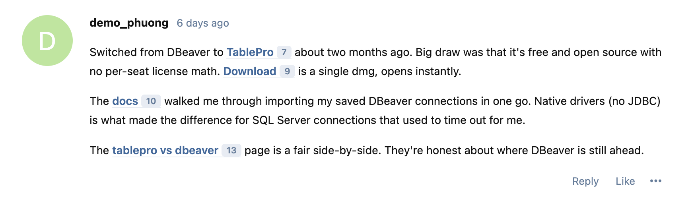
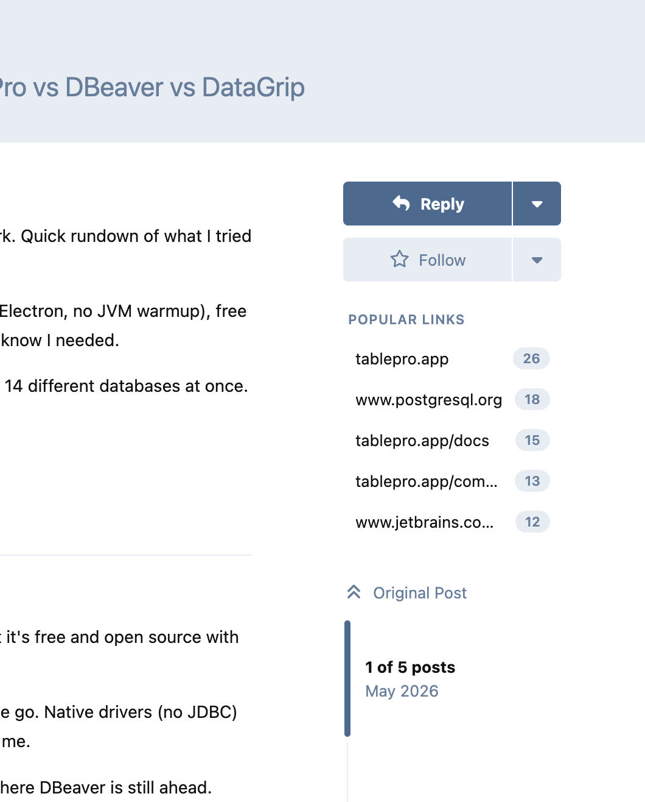
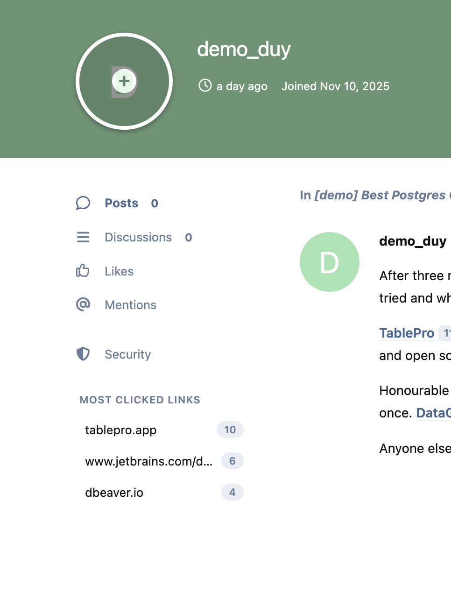
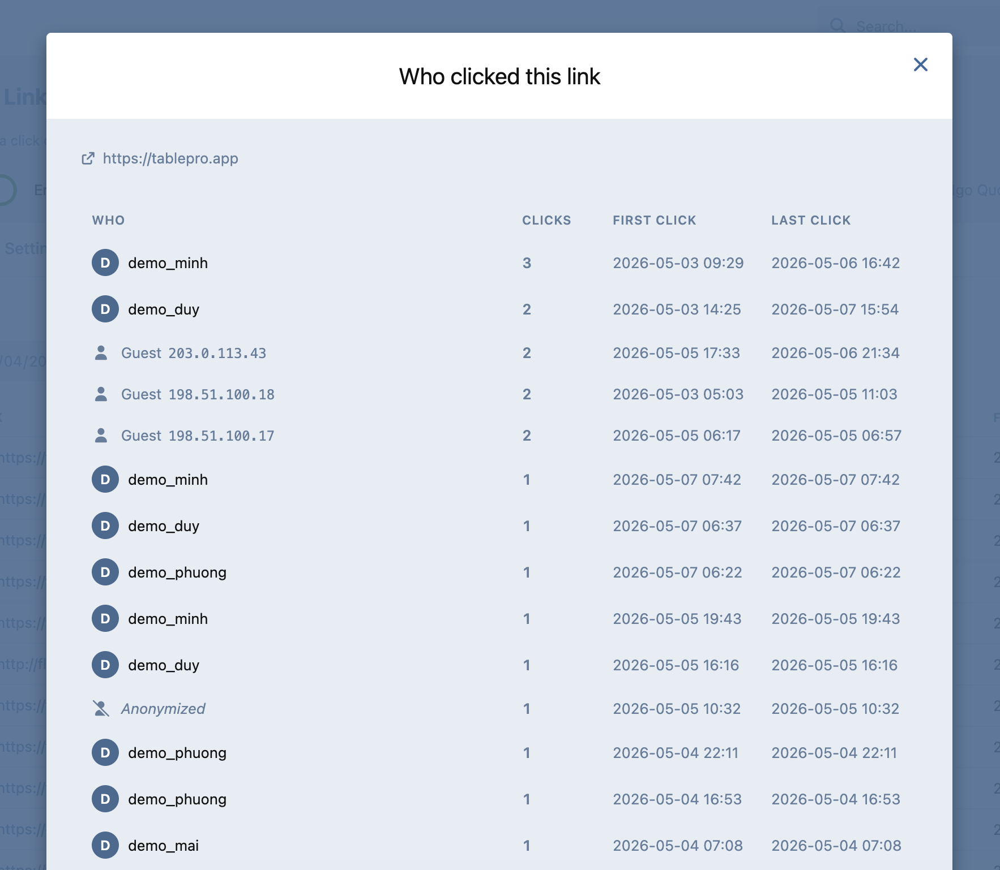
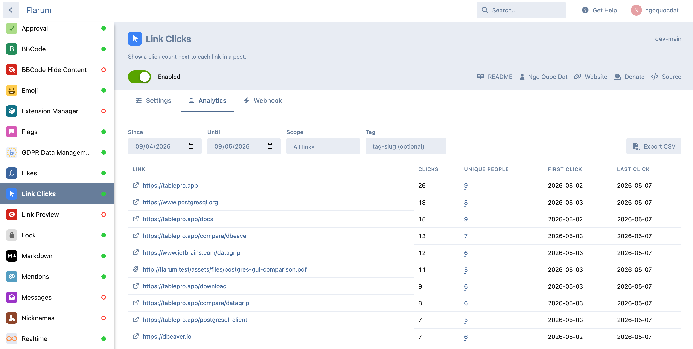

# Link Clicks

[](LICENSE.md) [](https://packagist.org/packages/datlechin/flarum-link-clicks) [](https://packagist.org/packages/datlechin/flarum-link-clicks)

Shows how many people opened each link in a post.



A small badge appears next to a link once people start clicking it. It inherits your theme and dark mode, and the number is visible to everyone reading the post.

Hashtags and mentions are links too, so they are counted the same way. `#support`, `@alice` and post mentions each get their own count.

```sh
composer require datlechin/flarum-link-clicks
php flarum migrate
```

Then enable it in **Admin → Extensions**.

## What you get

**In the forum**

- Click badges on links, `#hashtags` and `@mentions`.
- Trending hashtags on the index, ranked by how sharply a hashtag's click rate has risen, not by lifetime total, so the list actually changes.
- Popular links in the discussion sidebar, and most-clicked links on user profiles.
- Live counts when `flarum/realtime` is installed, without a reload.

**For moderators and admins**

- Analytics with filters and CSV export, plus a daily chart, top domains, a weekday-by-hour heatmap, and a device breakdown.
- Per-link drill-down showing who clicked, and per-user click trails.
- Per-discussion stats from the discussion controls menu.

| Popular links | Most clicked on a profile | Who clicked |
|---|---|---|
|  |  |  |

## Settings

**Admin → Extensions → Link Clicks** has three tabs: Settings, Analytics and Webhook.



### Counting

| Setting | Default | |
|---|---|---|
| `enabled` | `true` | Master switch. Off means no badges and no recording. |
| `min_display_count` | `1` | Hide the badge below this number. |
| `dedup_window_hours` | `24` | One person counts once per link within this window. |
| `track_internal` | `false` | Also count links back to the forum. Attachments are counted either way. |
| `track_tag_mentions` | `true` | Count `#hashtag` clicks. Needs `flarum/mentions` and `flarum/tags`. |
| `track_user_mentions` | `true` | Count `@username` clicks. Needs `flarum/mentions`. |
| `track_post_mentions` | `true` | Count post-mention clicks. Needs `flarum/mentions`. |

### Privacy

| Setting | Default | |
|---|---|---|
| `honor_dnt` | `true` | Skip recording when the request sends `DNT: 1`. The link still works. |
| `skip_guests` | `false` | Count logged-in users only. |
| `event_retention_days` | `90` | Delete click events older than this. `0` keeps everything. |
| `bot_user_agents` | | Extra User-Agent fragments to treat as bots, one per line. |

### Links

| Setting | Default | |
|---|---|---|
| `open_in_new_window` | `false` | Open tracked links in a new tab. |
| `confirm_external_clicks` | `false` | Ask before sending a reader off the forum. |
| `domain_blocklist` | | Hosts to ignore entirely, one per line. `*.example.com` covers subdomains. |
| `tracking_params_strip` | | Extra query params to strip so variants of one URL merge. `utm_*`, `fbclid`, `gclid`, `mc_*`, `igshid` and `_ga` are already covered. Trailing `*` matches a prefix. |
| `attachment_path_prefixes` | | Extra paths to treat as attachments. `/assets/files/` is built in. |

### Reports

| Setting | Default | |
|---|---|---|
| `trending_enabled` | `true` | Show trending hashtags on the index. |
| `trending_min_clicks` | `5` | Ignore hashtags below this many clicks in the last counted day. |
| `digest_enabled` | `false` | Email admins a weekly summary on Monday morning. |
| `anomaly_threshold_ratio` | `10` | Warn when a day's clicks exceed the prior six-day average by this much. |
| `anomaly_min_clicks` | `20` | Skip the check below this volume, so quiet forums stay quiet. |

### Permission

**View link click analytics**. Admins have it by default. Grant it to other groups in **Admin → Permissions**.

## Webhook

Every recorded click is POSTed to your URL as JSON. Set a secret to sign the body.

```json
{
  "event": "click_recorded",
  "counted": true,
  "post_link": {
    "id": 123,
    "source": "url",
    "url": "https://example.com/page",
    "label": null,
    "is_internal": false,
    "is_attachment": false,
    "post_id": 456,
    "discussion_id": 789,
    "clicks_count": 42
  },
  "actor": { "user_id": 10, "username": "alice" },
  "ip_address": "192.168.1.1",
  "user_agent": "Mozilla/5.0 ...",
  "clicked_at": "2026-05-09T12:34:56Z"
}
```

- `source` is `url`, `tag_mention`, `user_mention` or `post_mention`. `label` holds a display name (`#support`, `@alice`) for mentions and is `null` for plain links.
- `counted` is `false` when the click hit a dedup or self-click rule, so the badge didn't move.
- `actor` is `null` for guests.
- With a secret set, the signature arrives in `X-LinkClicks-Signature: sha256=<hex>` over the raw body.

Delivery is queued and retried with backoff. The Webhook tab has a **Send test ping** button.

## Console commands

Everything below is scheduled already; run them by hand only when you want to.

| Command | |
|---|---|
| `link-clicks:backfill` | Register links in posts written before the extension was enabled. Safe to re-run. `--chunk=N`, `--from-id=X`. |
| `link-clicks:reconcile` | Recount from the recorded events and correct any drift. `--dry-run` reports without writing. |
| `link-clicks:build-daily-rollup` | Aggregate events into the daily table behind the chart. `--rebuild` recomputes from scratch. |
| `link-clicks:purge-events` | Delete events past the retention window. |
| `link-clicks:detect-anomalies` | Log a warning when a day's clicks spike. |
| `link-clicks:send-digest` | Email the weekly summary now. |

## Privacy and GDPR

Each recorded click stores an IP address and User-Agent, which are personal data under GDPR. As the forum operator you need to disclose the collection in your privacy notice, choose a lawful basis (legitimate interest is the usual fit), and set a retention window. `event_retention_days` and the daily purge handle the last part.

Install `flarum/gdpr` and access, export and erasure requests are handled for you.

The defaults lean private: bots are dropped, `DNT: 1` is honoured, authors can't inflate their own counts, and the tracking URL never carries the destination.

## Adding your own trackable

Anything clickable in a post can be counted. Implement `TrackableSource`. It says which formatter tag to read, how to find targets in a post, and where a click should land. Then register it:

```php
(new Datlechin\LinkClicks\Extend\TrackableSources())
    ->add(MyPollVoteSource::class),
```

It flows through extraction, rendering, click recording, analytics, GDPR and the console commands with no further wiring.

## Sponsors

If this is useful to you, [sponsoring on GitHub](https://github.com/sponsors/datlechin) helps me keep maintaining it.

## Links

[Packagist](https://packagist.org/packages/datlechin/flarum-link-clicks) · [GitHub](https://github.com/datlechin/flarum-link-clicks) · [Discuss](https://discuss.flarum.org/d/39223)
